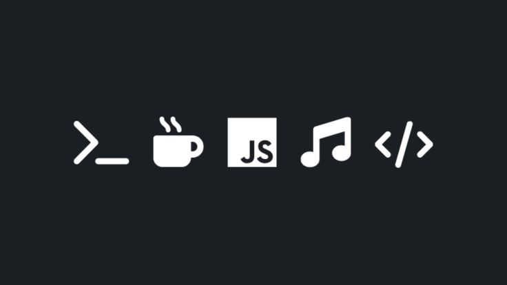

<h1 align="center">Hi 👋, I'm Fidel Adar</h1>
<h3 align="center">
  <a href="http://github.com/ad4rtech" target="_blank">A Front-End Developer 🧑‍💻</a> 
  and 
  <a href="www.linkedin.com/in/fidel-adar" target="_blank">Network Administration Enthusiast 🚠</a>
</h3>

<table align="center">
<tr>
  <td width="55%" align="center">
    
  </td>
  <td width="45%" align="left" valign="middle">

### 🌟 Quick Overview

🌱 **Currently Learning:** Tailwind CSS, SASS/SCSS, and TypeScript  
🔭 **Current Project:** Building an Airbnb Clone Application to enhance my frontend development skills  
🌍 **Languages:** English and Kiswahili  
📫 **Contact:** [adarfidel.ogw@gmail.com](mailto:adarfidel.ogw@gmail.com)

  </td>
</tr>
</table>

---

## About Me

<table>
<tr>
<td width="30%">
  

</td>
<td width="70%">

  Hi there! 👋 I’m <strong>Fidel Adar</strong>, a <strong>Junior Frontend Developer</strong> and 
  <strong>Network Administration Enthusiast</strong> who’s passionate about building beautiful, responsive, 
  and efficient web interfaces.
    
  I love blending creativity with logic turning complex ideas into clean, user-friendly designs.
    
  Outside coding, I’m intrigued by <strong>network systems</strong>, <strong>cloud infrastructure</strong>, 
  and <strong>internet connectivity</strong> that make the web possible.
    
  I’m continuously learning, experimenting, and striving to become a better developer every day. 🚀

</td>
</tr>
</table>

---

## How to Reach Me 📬

  
  
  

---

## My Skills 🧠

---

## 🧰 My Arsenal

<table>
  <tr>
    <td valign="top" width="50%">
      <h3>⚙️ Frontend Development Tools</h3>
      <table>
        <tr>
          <th>Tool</th>
          <th>Description</th>
        </tr>
        <tr>
          <td></td>
          <td>Version Control</td>
        </tr>
        <tr>
          <td></td>
          <td>Code Hosting</td>
        </tr>
        <tr>
          <td></td>
          <td>Markup Language</td>
        </tr>
        <tr>
          <td></td>
          <td>Styling Language</td>
        </tr>
        <tr>
          <td></td>
          <td>Utility-First CSS Framework</td>
        </tr>
        <tr>
          <td></td>
          <td>UI/UX Design Tool</td>
        </tr>
      </table>
    </td>

  <td valign="top" width="50%">
      <h3>🌐 Network Administration Tools</h3>
      <table>
        <tr>
          <th>Tool</th>
          <th>Description</th>
        </tr>
        <tr>
          <td></td>
          <td>Networking Fundamentals & CCNA Concepts</td>
        </tr>
        <tr>
          <td></td>
          <td>Cloud Infrastructure & Services</td>
        </tr>
      </table>
    </td>
  </tr>
</table>

## 📝 My Blog

I share insights on **web development** and **networking fundamentals** to inspire and guide other tech learners.  

---

## 📊 GitHub Stats

  
  

---

⭐ **“Code. Connect. Create.”** 

